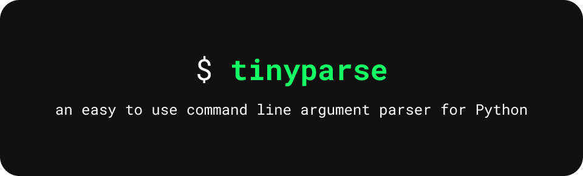

<p align="center" width="100%">
    
</p>

# tinyparse

Installation
------------

Install `tinyparse` through `pip`.
```bash
$ pip install tinyparse
```

Usage
-----

Start with importing `tinyparse` and the built-in `sys` library. Initialise the argument parser by inputting the tool description and the `sys.argv` list. Define a flag/option/argument with a variable assigned to  `tinyparse`'s argument functions. You can retrieve the argument values however you wish to. 

```python
# This is an example from https://github.com/apple/swift-argument-parser
import tinyparse
import sys

parser = tinyparse.ArgumentParser("Repeat a value.", sys.argv)

includeCounter = parser.Flag('include-counter', 'Include a counter with each repetition.')
count = parser.Option('count', 'The number of times to repeat a value.', int )
phrase = parser.Argument('phrase', 'The value to repeat.', int )

if __name__ == '__main__':
    
    if count:
        repeatCounter = count
    else:
        repeatCounter = 5
    
    for i in range(0, repeatCounter): 
        if includeCounter:
            print(f"{i+1}: {phrase}")
        else:
            print(phrase)
```

`tinyparse` is a fast and minimal, coming in at just under 200 lines.

Documentation
-------------

Articles, guides and more can be read at [`docs/README.md`](./docs/README.md).

### Examples
- [`repeat`](https://github.com/wandxp/tinyparse/blob/main/examples/repeat/repeat.py) is a Python port for the Swift argument parser example and is the example shown above.

Status
------

`tinyparse` is beta software. it is not a finished product and may not contain all features.

### TODO

- implement `--help` and `--version`
- implement subcommands
- implement better flag generation
- write better inline commments 
- write better documentation

### Contributing

All contributions to tinyparse are welcome! Just fork this repo, commit your changes, and create a pull request. As simple as that :D